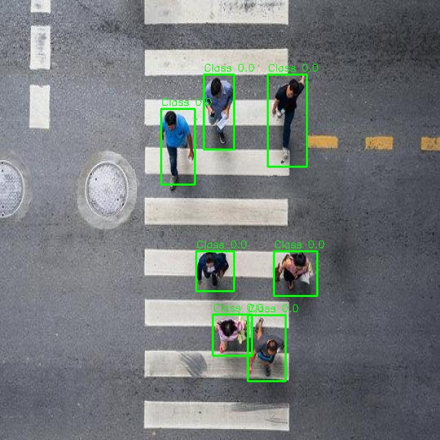
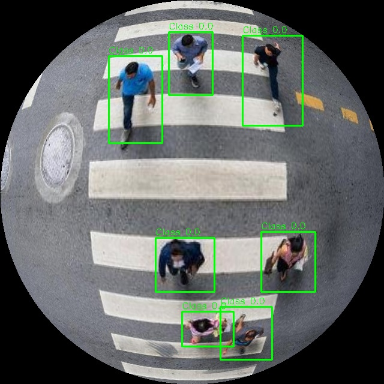
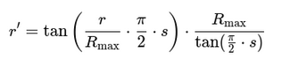

# Fisheye Dataset Transformer

    

## 📌 Introduction
This repository provides a highly optimized pipeline to transform a YOLO dataset from **Roboflow format** into a **fisheye-transformed dataset**, distorting both images and bounding boxes. It is designed to simulate the view of **fisheye cameras** (e.g., **Intel RealSense T265**), making it suitable for training vision models under wide-angle lens effects.

## Original Bounding Box
<p align="center">

</p>

### Fisheye Bounding Box
<p align="center">
    
</p>


## 📚 Dataset Format
```
Dataset/
├── train/
│   ├── images/
│   └── labels/
├── valid/
│   ├── images/
│   └── labels/
├── test/ (optional)
│   ├── images/
│   └── labels/
└── data.yaml
```

## 🚀 How It Works
### 🎥 Fisheye Image Transformation
1. **Square Resize**: Each image is resized to a square to maintain isotropic distortion.

2. **LUT (Lookup Table) Computation**:
   - A radial distortion function remaps each pixel based on its distance to the center.
   - The LUT is computed only once from a training image and reused across all samples.

3. **Radial Distortion Equation**:
   For a pixel at distance \( r \):
    <p align="center">
    
   </p>

   where:
   - r: original radius
   - R_max: maximum radius
   - s: strength of distortion
   - r: distorted radius

4. **Circular Region Masking**: Pixels outside the visible circle are set to black to simulate a true fisheye lens.

### 🔄 Bounding Box Remapping
1. **YOLO Absolute Conversion**: Converts `[class_id, x_center, y_center, w, h]` into absolute pixel coordinates.

2. **Mask Generation**: Each bbox is drawn as a binary mask.

3. **Mask Distortion**: Same LUT is applied to the mask using `cv2.remap()`.

4. **Contour Extraction**: Uses `cv2.findContours()` to detect the new bounding shape.

5. **BBox Recalculation**:
   - Extracts the new bounding rectangle from the distorted contour.
   - Clips it to stay within the circular area.
   - Discards boxes too small or fully outside the view.

6. **Normalization**: Final bboxes are normalized back to `[x_center, y_center, w, h]` format.

## 🌀 Parallel Processing Pipeline
- All image-label pairs are processed in parallel using `ProcessPoolExecutor`.
- Number of workers = `os.cpu_count()`.
- LUT is computed **once** and passed to each subprocess.
- Each process runs `process_single_image()` independently.


## 🔧 How to Use
```python
from process_yolo_dataset import process_yolo_subset, update_yaml, get_LUT

INPUT_DATASET = "./original_dataset"
OUTPUT_DATASET = "./fisheye_dataset"
STRENGTH = 0.65

# Generate fisheye LUT from a sample training image
map_x, map_y = get_LUT(INPUT_DATASET, STRENGTH)

# Transform each subset
for subset in ['train', 'val', 'test']:
    images_dir = f"{INPUT_DATASET}/{subset}/images"
    labels_dir = f"{INPUT_DATASET}/{subset}/labels"
    output_images_dir = f"{OUTPUT_DATASET}/{subset}/images"
    output_labels_dir = f"{OUTPUT_DATASET}/{subset}/labels"
    process_yolo_subset(images_dir, labels_dir, output_images_dir, output_labels_dir, map_x, map_y)

# Update YAML
update_yaml(f"{INPUT_DATASET}/data.yaml", f"{OUTPUT_DATASET}/data.yaml", OUTPUT_DATASET)
```

## 👀 Visualization Utility
```python
from generate_new_bboxes import draw_yolo_bboxes, load_yolo_bboxes
import cv2

image = cv2.imread("fisheye_dataset/train/images/image1.jpg")
labels = load_yolo_bboxes("fisheye_dataset/train/labels/image1.txt")
image_with_boxes = draw_yolo_bboxes(image, labels)
cv2.imwrite("output/image1_preview.jpg", image_with_boxes)
```

## ⚠️ Limitations
- Bounding boxes remain rectangular.
- The outer circular region might remove objects near edges.


